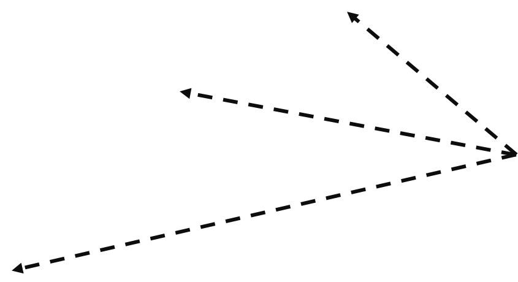
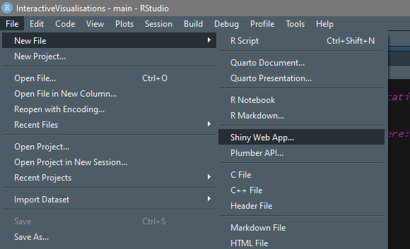

class: hide_logo
background-image: url("images/thinking.png"),url("images/typing.png")
background-position: 10% 27%, 10% 80%
background-size: 15%,20%

```{r setup, echo=FALSE}
knitr::read_chunk('assets/init.R')
```

```{r, echo=FALSE, cache=FALSE, message=FALSE}
<<init>>
```

## Outline `r top_icon("list")`

--
.content-box-shift1[
- ### What is an “interactive visualisation"?
- ### Why adding interactivity to data visualisations?
- ### Interactive visualisations in epidemiology
]
 
--
.content-box-shift2[
- ### Building interactive visualisations
- ### Interactive visualisations in R with *Shiny*  
]

???
What is a IV, its defining characteristics and elements
Building interactive visualisations: what do we need (a 'high level' overview)

---
## What is an “interactive visualisation”?  `r top_icon("question")`

<br/><br/><br/><br/>
##.center[*"a computational tool that store, process and visually represent data to facilitate interactive exploration"*]

.right[<cite>`r Citet(bib, "Ola2016")`</cite>]

???
Key words: 
1. **computational tool**: it is not just something we can "look at" (an image). Visual representation (i.e. generating an image) is only one element of an interactive visualisation.  An interactive visualisation also needs a way to **store** data (or access dynamically form external sources) and **process** the stored data according to the user inputs (and, often, not only from the user, but from external sources: e.g., to reach to change in the data over time).
2. **interactive**: obvious, and interactive visualisation need a way to "interact" with the users, i.e. to respond to their inputs (And, sometimes, suggest further inputs)
3. **facilitate exploration**: the final objectbe of an interactive visualisation is to allow users to get **better insights** on the data, compared to those they can get form a static visualisation (or from no-visualisation).

---
class: hide_logo 
background-image: url("images/data.png"),url("images/gears.gif"),url("images/visual.png"),url("images/arrow_2.png"),url("images/arrow_2.png")
background-position: 10% 80%, 25% 40%, 50% 10%,37% 17%,18% 56%
background-size: 10%,20%,15%, 6%,6%

???
Users (they can be more than one...) interact with the tool at different points of the visualisation process: they can change the data, the can modify the processing (e.g. use different statistics), and the can modify the visual appearance of the visualisation beyond the data (change fonts, backgrounds, borders...)

In other words, they interact with each elements of a visualisation, as defined in the grammar of graphics...

--
</img>
</img>

--
<div style="position:relative; margin-top: -13%; margin-left: 40%; font-size: 100%; background: white; text-align: center; width: 100px;">Data</div>
<div style="position:relative; margin-top: -14%; margin-left: 45%; font-size: 100%; background: white; text-align: center; width: 150px;">Aesthetics, geometries, statistics,.....</div>
<div style="position:relative; margin-top: -12%; margin-left: 52%; font-size: 100%; background: white; text-align: center; width: 100px;">Theme</div>

---
background-image: url("images/bigdata.png"), url("images/3dgraph.png"),url("images/insight.png")
background-position: 10% 50%, 60% 50%, 90% 50%
background-size: 30%, 30%, 15%
## Why adding *interactivity* to data visualisations?  `r top_icon("question")`

--
</img>

---
class: hide_logo
background-image: url("images/gtrends.png")
background-position: 50% 50%
background-size: 80%

<a href = "https://www.internetlivestats.com/google-search-statistics/"></img></a>


.footnote[.large[[https://trends.google.com/trends/?geo=ZA](https://trends.google.com/trends/?geo=ZA)]]

???
dynamic data (very rapid change: ~40000 search/second)
large quantities
different interests (content, geolocation,...)

---
class: hide_logo
background-image: url("images/3dcat.png"), url("images/3dnum.png"), url("images/arrow_3.png")
background-position: 5% 30%, 90% 30%, 80% 87%
background-size: 45%, 45%, 8%


<div style = "position: relative; padding-top: 53%; left: 75%; font-size: 80%; "><cite> `r Citet(bib, "luz2022")` </cite></div>
 

.footnote[.large[[https://webtoolkit.eu/widgets/graphics-charts/3d-category-chart](https://webtoolkit.eu/widgets/graphics-charts/3d-category-chart) <br/> 
          [https://webtoolkit.eu/widgets/graphics-charts/3d-numerical-chart](https://webtoolkit.eu/widgets/graphics-charts/3d-numerical-chart)] <br/><br/><br/>]

???
The only way I can really appreciate 3d visualisations (excluding some very simple cases, where patterns are evident...)

An example of 3d visualisations in infectious disease epidemiology (which we don't look at together)

---
class: hide_logo
background-image: url("images/perspectives.png")
background-position: 50% 50%
background-size: 50%

???
Insight: A new way of viewing the world that causes us to reexamine existing conventions and challenge the status quo.

---
class: hide_logo
background-image: url("images/pubmed.png")
background-position: 50% 65%
background-size: 60%
## Interactive data visualisations are increasingly used in the health sciences...

.footnote[Number of PubMed listed publications including the terms *interactive data visualisation*, by year]

---

class: hide_logo
background-image: url("images/christie_1.png"),url("images/christie_2.png"), url("images/circle.png"), url("images/results.png")
background-position: 50% 25%, 50% 65%, 20% 98%, 80% 82%
background-size: 90%, 90%, 10%, 18%
## ... and in Public Health 

<a href = "https://public.tableau.com/app/profile/jawad.chishtie/viz/InteractiveVisualizationApplicationsinPopulationHealthandHealthServicesResearch-Jan2005toMarch2019/DataSource"></img></a>

.footnote[.scriptsize[<cite>`r Citet(bib, "Chishtie2022")`</cite>]]
 
---
class: hide_logo
background-image: url("images/IHME.png")
background-position: 50% 30%
background-size: 80%

.footnote[[https://www.healthdata.org/data-tools-practices/interactive-data-visuals](https://www.healthdata.org/data-tools-practices/interactive-data-visuals)]

---
class: hide_logo
background-image: url("images/ward.png"), url("images/liere.png"),url("images/mdpi.png")
background-position: 10% 50%, 50% 50%, 90% 50%
background-size: 25%, 25%, 25%
## Some general references:

.footnote[<cite> `r Citet(bib, "Ward2010")` ; `r Citet(bib, "Ebert2018")` ; `r Citet(bib, "Zudilova2009")`</cite>         ]

---
class: hide_logo
background-image: url("images/gcharts.png"), url("images/tableaui.png"),url("images/powerbi.png"),url("images/tableau.png"), url("images/infogram.png"),url("images/rawgraphs.png")
background-position: 10% 25%, 50% 25%, 90% 25%, 10% 70%, 50% 70%, 90% 70%
background-size: 25%, 25%, 25%, 25%, 25%, 25%
## Building Interactive visualisations: tools 

.footnote[
[https://www.forbes.com/advisor/business/software/best-data-visualization-tools/](https://www.forbes.com/advisor/business/software/best-data-visualization-tools/)<br/>
[https://www.wordstream.com/blog/ws/2016/09/29/data-visualization-tools](https://www.wordstream.com/blog/ws/2016/09/29/data-visualization-tools)</br>
[https://www.intellspot.com/open-source-data-visualization/](https://www.intellspot.com/open-source-data-visualization/)<br/>
[https://solutionsreview.com/business-intelligence/the-ultimate-list-of-open-source-and-free-data-visualization-tools/](https://solutionsreview.com/business-intelligence/the-ultimate-list-of-open-source-and-free-data-visualization-tools/)
]

???
Many tools, with different characteristics:
- web applications
- desktop software
- libraries
- integration with otehr apps
- element of data analysistcs
- machine learning
- free and expensive (subscriptions)
- open socurce and commercial

---
class: hide_logo 
background-image: url("images/data.png"),url("images/gears.gif"),url("images/visual.png"),url("images/arrow_2.png"),url("images/arrow_2.png"),url("images/links_1.png"),url("images/users.png")
background-position: 10% 90%, 25% 50%, 50% 20%,37% 27%,18% 66%, 50% 71%,85% 71%
background-size: 10%,20%,15%, 6%,6%,50%,10%

--
</img>

???

All share the same elements (mor or less 'buried' into the system and visible to the users)

We a place to store /retrieve the data
We need a "tool" to process the data
We need an interface to visualise the data
We need an interface to allow users to "interact" with the system and modify one or more of tehse emelents (data, processing, visualisation)

---
class: hide_logo
background-image: url("images/typing.png")
background-position: 50% 50%
background-size: 50%

---
class: hide_logo
background-image: url("images/ofg_1.png")
background-position: 50% 50%
background-size: 60%
## Example 1: the *old faithful geyser* app 

--
</img>

---
class: hide_logo
.scroll-output[

```{r echo=TRUE, eval= FALSE }

library(shiny)

ui <- fluidPage(

    # Application title
    titlePanel("Old Faithful Geyser Data"),

    # Sidebar with a slider input for number of bins 
    sidebarLayout(
        sidebarPanel(
            sliderInput("bins",
                        "Number of bins:",
                        min = 1,
                        max = 50,
                        value = 30)
        ),

        # Show a plot of the generated distribution
        mainPanel(
           plotOutput("distPlot")
        )
    )
)

server <- function(input, output) {

    output$distPlot <- renderPlot({
        # generate bins based on input$bins from ui.R
        x    <- faithful[, 2]
        bins <- seq(min(x), max(x), length.out = input$bins + 1)

        # draw the histogram with the specified number of bins
        hist(x, breaks = bins, col = 'darkgray', border = 'white',
             xlab = 'Waiting time to next eruption (in mins)',
             main = 'Histogram of waiting times')
    })
}

shinyApp(ui = ui, server = server)

```

]

???
ui (user interface): visualisation, interactivity (input/output)
server: processing 

Where are the data? in this case are provided by the R environment itself (as the ofg is a standard R dataset)

---
class: hide_logo
background-image: url("images/banner.png")
background-position: 98% 98%
background-size: 25%
## Example 2: A dashboard for *Cardiovascular Risk Factors in SA* 

.footnotesize[
```{r}
load("data/cvd.RData")
head(DATA)
```
]

.pull-left[
```{r}

nrow(DATA)
unique(DATA$year)

```
]
---
class: hide_logo
background-image: url("images/app.png")
background-position: 50% 50%
background-size: 90%

---
class: hide_logo
background-image: url("images/shiny.png"), url("images/ggplot2.png"), url("images/plotly.png"), url("images/shinydash.png"), url("images/arrow_3.png") 
background-position: 5% 50%,40% 15%, 68% 80%, 95% 20%,10% 90%
background-size: 25%,25%,18%,25%,10%

.footnote[[https://rstudio.github.io/shinydashboard/index.html](https://rstudio.github.io/shinydashboard/index.html)]

---
class: hide_logo
## Setup

.center[*Install packages*]

```{r, eval = FALSE}
install.packages(c("shiny","shinydashboard","ggplot2","plotly"))
```

.center[*Create three files .R*]

```{r, eval = FALSE}
global.R --> code to be execute when the app starts 
server.R --> server
ui.R --> user interface
```

---
class: hide_logo

.center[*global.r*]

```{r, eval = FALSE}
library(shiny)
library(dplyr)
library(ggplot2)
library(shinydashboard)
library(plotly)

load("cvd.RDATA")
```

class: hide_logo

.center[*ui.r*]

```{r, eval = FALSE}
dashboardPage(
  dashboardHeader(),
  dashboardSidebar(),
  dashboardBody()
```

.center[*server.r*]

```{r, eval = FALSE}
function(input, output) {
```

---
class: hide_logo
background-image: url("images/rstudio.png")
background-position: 50% 50%
background-size: 30%


.footnote[.large[
</img> <br/><br/>
Code of the example on GitHub (*/code/cvd*): <br/> 
<a href = "https://github.com/AnnibaleCois/InteractiveVisualisations">https://github.com/AnnibaleCois/InteractiveVisualisations</a>
<br/>
Direct download links: <a href="code/cvd/global.R" download>global.R</a>, <a href="code/cvd/ui.R" download>ui.R</a>, <a href="code/cvd/server.R" download>server.R</a>, <a href="code/cvd/cvd.RDATA" download>cvd.RDATA</a>
]
]
---
class: hide_logo
## User Interface (ui.R)

.scroll-output[
```{r, eval = FALSE}
dashboardPage(
  dashboardHeader(title = "Cardiovascular Risk Dashboard"),
  dashboardSidebar(
    sliderInput(
      inputId = "riskThreshold", 
      label = "Risk Threshold",
      min = 0, 
      max = 50, 
      value = 3, 
      step = 1
    ),
    checkboxGroupInput(
      inputId = "geotype",
      label = "Geotype",
      inline = TRUE,
      choices = c("Urban","Rural"),
      selected = c("Urban","Rural")
    ),
    checkboxGroupInput(
      inputId = "sex",
      label = "Sex",
      inline = TRUE,
      choices = unique(DATA$sex),
      selected = c("Male","Female")
    ),
    checkboxGroupInput(
      inputId = "agecat",
      label = "Age Groups",
      inline = TRUE,
      choices = unique(DATA$agecat),
      selected = c("50-54")
    ),
    radioButtons(
      inputId = "year",
      label = "Year",
      inline = TRUE,
      choices = unique(DATA$year),
      selected = 2016
    ), 
    sidebarMenu(
      menuItem("Dashboard", tabName = "dashboard"),
      menuItem("Raw data", tabName = "rawdata")
    )
  ),
  dashboardBody(
    tabItems(
      tabItem("dashboard",
        fluidRow(
          valueBoxOutput("ssize"),
          valueBoxOutput("cvdrisk"),
          valueBoxOutput("excessrisk")
        ),
        fluidRow(
          box(
            width = 8, status = "info", solidHeader = TRUE,
            title = "Cardiovascular risk, by province",
            plotlyOutput("riskPlot", width = "100%", height = 600)
            #plotOutput("riskPlot", width = "100%", height = 600)
          ),
          box(
            width = 4, status = "info",
            title = "Risk factors, averages",
            tableOutput("riskTable")
          )
        )
      ),
      tabItem("rawdata",
        numericInput("maxrows", "Rows to show", 25),
        verbatimTextOutput("rawtable"),
        downloadButton("downloadCsv", "Download as CSV")
      )
    )
  )
)
```
]

---
class: hide_logo
## Server (server.R)

.scroll-output[
```{r, eval = FALSE}
function(input, output) {

# Filter data according to inputs
  
  data_filtered <- reactive({
    subset(DATA,
           sex %in% input$sex &
           agecat %in% input$agecat &
           year %in% input$year &
           geotype %in% input$geotype)  
  })
  
# Recalculate outputs every time an input changes  
  
    # Sampe size 
  
  rowCount <- reactive({
    nrow(data_filtered())
  })
  
    output$ssize <- renderValueBox({
    valueBox(
      value = rowCount(),
      subtitle = "Sample size",
      icon = icon("database"),
      color = "aqua"
    )
  })
  
    # Average CVD risk 
    
  avgRisk <- reactive({
    paste(round(mean(data_filtered()$cvdrisk, na.rm = TRUE),1),"%", sep = "")
  })
  
  output$cvdrisk <- renderValueBox({
    valueBox(
      value = avgRisk() ,
      subtitle = "Average CVD risk",
      icon = icon("heart-crack"),
      color = "red"
    )
  })
  
   # Percentage above risk threshold
 
  excRisk <- reactive({
    paste(round(mean(data_filtered()$cvdrisk > input$riskThreshold, na.rm = TRUE)*100,1),"%", sep = "")
  })
  
  output$excessrisk <- renderValueBox({
    valueBox(
      excRisk(),
      "Risk above threshold",
      icon = icon("percent"),
      color = "yellow"
    )
  })
  
  
  # Bar chart with provincial averages

  output$riskPlot <- renderPlotly({
    #output$riskPlot <- renderPlot({
    data <- data_filtered()
    if (nrow(data) == 0)
      return()
    data_province <- aggregate(data$cvdrisk, by = list(data$province), FUN = mean)
    data_province <- rename(data_province, Province = Group.1, cvdrisk = x ) 
    
    ggplot(data_province) +
      aes(x = Province, y = cvdrisk, fill = Province) +
      geom_bar(stat = "identity") +
      theme(legend.position = "none")
    
    })

  # Table with average levels of risk factors
  
  output$riskTable <- renderTable({
    data <- data_filtered()
    if (nrow(data) == 0)
      return()
    data_province <- aggregate(data[,c("bmi","sbp","dbp")], by = list(data$province), FUN = mean) 
    data_province <- rename(data_province, Province = Group.1) 
    data_province
  }, digits = 1)
  
  
  # Raw data table 
  
   output$rawtable <- renderPrint({
    orig <- options(width = 1000)
    print(tail(data_filtered(), input$maxrows), row.names = FALSE)
    options(orig)
  }) 
  
  # Download data 
  
   output$downloadCsv <- downloadHandler(
    filename = "data.csv",
    content = function(file) {
      write.csv(data_filtered(), file)
    },
    contentType = "text/csv"
  )
}

```
]

---
class: hide_logo
background-image: url("images/app.png")
background-position: 50% 50%
background-size: 90%

---
class: hide_logo
background-image: url("images/deploy.png")
background-position: 50% 60%
background-size: 80%
## Deploying your app

--
</img>

.footnote[.large[https://www.shinyapps.io/]]

---
background-image: url("images/deploy_1.png")
background-position: 50% 50%
background-size: 90%

--
</img>


---
```{r, eval = FALSE}
#install.packages(c("rmarkdown","rsconnect")

library(rsconnect)
library(rmarkdown)

# Set account (Only once)
rsconnect::setAccountInfo(name = 'sacra2',
			  token = '<token>',
			  secret = '<secret>')

# Deploy new version
    
rsconnect::deployApp('Alcohol', account = "sacra2")
```

--
.content-box-yellow[
.center[
.large[
https://your-account-name.shinyapps.io/your-directory-name
]
]
]  
--
<br/>
  
.content-box-darkorange[
.center[
.large[
https://sacra2.shinyapps.io/alcohol/
]
]
]

---
class: hide_logo
background-image: url("images/reading.png")
background-position: 90% 90%
background-size: 20%
## References  

.scriptsize[
```{r, echo=FALSE, cache=FALSE, message=FALSE, results = 'asis'}

PrintBibliography(bib)
```
]

---
class: su-white
<br/><br/>

.font200[
<p style ="font-size:200%; margin-bottom: -10px; margin-left: -5px;">Thank You!</p>
[ acois@sun.ac.za](mailto:acois@sun.ac.za)
]
<br/><br/>

<div style = "text-align: right; position: fixed; right: 100px;">

</img> <br/><br/>
The rmarkdown code of this presentation is available on GitHub: <br/> 
<a href = "https://github.com/AnnibaleCois/InteractiveVisualisations">https://github.com/AnnibaleCois/InteractiveVisualisations</a> 

</div>

